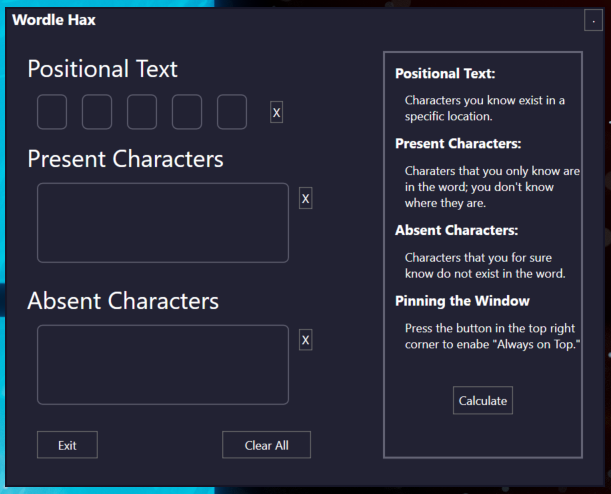
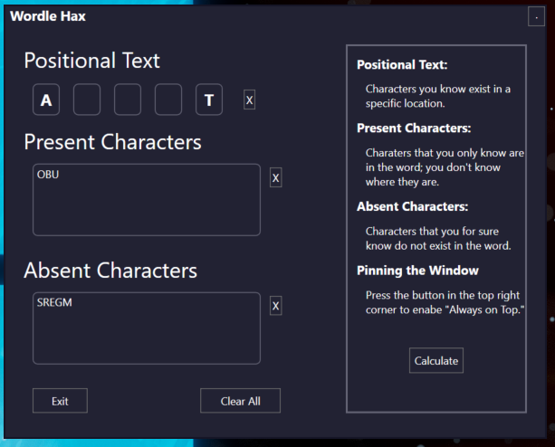
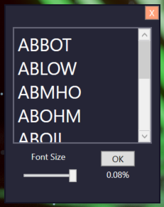

# Wordle Hax

This program lets you "cheat" at wordle; AKA make it more fun!

# Using the UI

## Positional Text
This is where you place characters you know for sure are in that specific position on the board. Simply place this character in the corresponding textbox, **and make sure that the character is not in any of the other boxes.**

## Present Characters
If you know the character is included, but don't know where it is, place it in this box. All characters will be separated by nothing in this box. **Make sure that characters placed in this box also don't appear in the absent characters section.**

## Absent Characters
If the character for sure doesn't exist (this also includes its existence in the positional text), then place the character here. This textbox follows the same rule as the last, where there are no spaces or other symbols in between characters.

## Completing Boxes
This is how boxes should be filled out when done properly:

## Calculating
When you hit the `calculate` button on the main menu, you will see a new window pop that looks like this one:

All possible answers can be seen in the main text box. The percentage under the `ok` button is the percentage of the words out of the full list visible (`Given Words / All Words`).

# Other UI Elements
 - On the main menu screen, the button in the top right with the `.` pins the window to the top of all other windows; this allows easy usage of the application while playing wordle.

 - The x's that appear to the sides of each textbox clear that specific text box.
 - To clear all text boxes, press the `Clear All` button at the bottom.

# How Does It Work?
After digging through the compiled javascript in the wordle frontend client, I was able to find the entire list of all wordle words. That's right. They have no backend, everything is ran directly on the frontend.

After retrieving all of these words, I simple wrote this program which sifts through all of the possible words and makes the corresponding words visible to you.